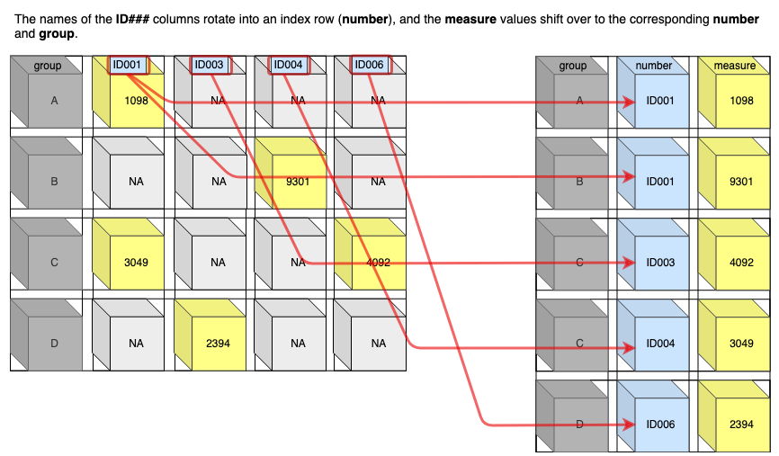

```{r setup, include=FALSE}
knitr::opts_chunk$set(echo = TRUE)

library(tidyverse)
library(kableExtra)
```

Sometimes when you're handling a dataset you find similar variables have been spread across multiple columns. Graphing these data often requires data to be contained within one column. Having one variable per column is also one of the key principles of the tidyverse. This vignette describes the use of `pivot_longer()` to transform yur data. 

### Related Google searches
How do you gather multiple columns into one column?  
How do you collapse multiple columns into one?  
How can you pivot columns into rows?  
How do I gather column names into rows?  
How do I tidy data?  
How do I prepare data for ggplot?  
  
### Using `pivot_longer()`   
`pivot_longer()` shifts column names into rows, making the data 'longer'. The original values under the columns are now sorted into a single column. This takes multiple columns with fewer rows and creates less columns with more rows.



*This function replaced **`gather()`** * 

### Packages
```{r, eval=FALSE}
library(tidyverse)
library(tidyr)
```


### Function
```{r form, eval = FALSE}
pivot_longer(data, cols, names_to, values_to, ...)
```

### **Required input**
What arguments are required for this function to run:  

* **data**: this is the data table to be used  

* **cols**: the columns to be pivoted into rows  

* **names_to**: used to specify the name of the column to be created from the original column names  

* **values_to**: the name of the column to be created from the value in the original rows. 

  
  
#### Example 1
For this simple example we have a list of proteins and modified residues. 
```{r example1 table, echo=FALSE}
Protein_Mod<- tribble(
  ~Protein, ~Residue_1,  ~Residue_2, ~Residue_3,
  "A", 14,  15, NA,
  "B", 28,  59, 79, 
  "C", 205, NA, 214
)

knitr::kable(Protein_Mod)%>%
  kable_styling(bootstrap_options = "striped", full_width = F)
```


We want to pivot the residues columns into a single 'Position' column. The residue sites will moved into a 'Site' column. 
To do so we use the following code

```{r pivotex1, eval=FALSE}
pivot_longer(Protein_Mod, cols=starts_with("Residue"), names_to = "Position", values_to = "Site")
```
```{r pivotex1 code, echo=FALSE}
Protein_ModEx1<- pivot_longer(Protein_Mod, cols=starts_with("Residue"), names_to = "Position", values_to = "Site")

knitr::kable(Protein_ModEx1)%>%
  kable_styling(bootstrap_options = "striped", full_width = F)%>%
  column_spec(1, bold = T, color = "gray")%>%
   column_spec(2, bold = T, color = "white", background = "red")%>%
   column_spec(3, bold = T, color = "white", background = "blue")
```


### **Optional Input**
Below is a summary of the most useful optional input. More option can be found in the help page and resources listed at the end of this page.

* **values_drop_na= TRUE/FALSE**  
    Default is FALSE. If TRUE, it will remove rows containing NA in the `value_to` output column.
    
* **names_prefix**  
    If you have rows with similar names, as in Example 1 where each column begins with 'Residue_' you can remove the common part of the name and be left with the unique values of each name.
    
        
#### Example 2
We can perform the same operation as Example 1 using some optional input information. Here, we drop the NA values and 'Residue' prefix when pivoting the data.

```{r pivotex2, eval=FALSE}
pivot_longer(Protein_Mod, cols=starts_with("Residue"), names_to = "Position", values_to = "Site", values_drop_na = TRUE, names_prefix = "Residue_")
```
```{r pivotex2 code, echo=FALSE}
Protein_ModEx2<-pivot_longer(Protein_Mod, cols=starts_with("Residue"), names_to = "Position", values_to = "Site", values_drop_na = TRUE, names_prefix = "Residue_")

knitr::kable(Protein_ModEx2)%>%
    kable_styling(bootstrap_options = "striped", full_width = F)%>%
  column_spec(1, bold = T, color = "gray")%>%
   column_spec(2, bold = T, color = "white", background = "red")%>%
   column_spec(3, bold = T, color = "white", background = "blue")
```

### **To learn more**
Tidyr reference page: https://tidyr.tidyverse.org/reference/pivot_longer.html  
pivot vignette: http://www.storybench.org/pivoting-data-from-columns-to-rows-and-back-in-the-tidyverse/ 


